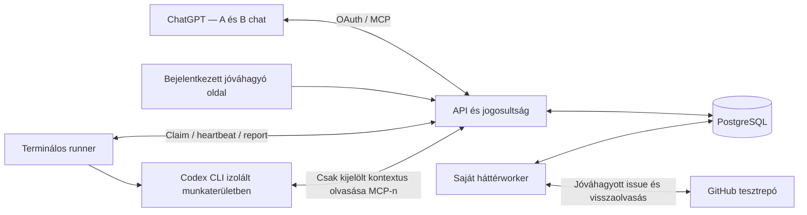

# PROJECT_CONTEXT — ChatGPT → projektkontextus → végrehajtás

Állapot: implementáció előtti terv, v1. Dátum: 2026-09-19.
Az alábbi komponensek és interfészek tervezettek, még nincsenek megvalósítva.

## 1. Cél és ellenőrzött kiindulás

A felhasználó a meglévő ChatGPT-ben beszélget. Saját MCP-szerverünk az explicit átadott kontextust tárolja, projekthez kapcsolja, és hozzáférhetővé teszi egy másik chatnek vagy terminálos végrehajtónak. A végrehajtás eredménye ugyanitt kérdezhető vissza.

A repó ellenőrzött kiindulása: `main`, `4e0cc40`; üres `README.md`, valamint `.gitignore`, benne `.env`. Alkalmazáskód, csomagmanifest, teszt, adatmodell és futtatási konfiguráció nincs. A helyi `.env` tartalmát nem olvastuk. A tervezés során ez a dokumentum az egyetlen hozzáadott fájl.

Felhasználói döntések:
- Két fejlesztő dolgozik, fejlesztőügynökökkel, párhuzamosan.
- Most tervezés történik, alkalmazáskód nem készül.
- Az előfizetés kiválasztása nem projektfeladat; a támogatott kliensfeltételeket dokumentálni kell.
- Az első külső integráció lehet GitHub issue-létrehozás. Ezt választjuk.
- A teljes ChatGPT-előzmény automatikus elérését tilos feltételezni.

Siker: chat A-ban mentett döntés → valódi terminálos AI-futás → ellenőrzött fájl → chat B-ből visszaolvasott eredmény. Ehhez egy jóváhagyott GitHub issue-létrehozás és egy zárt chat mellett működő időzített futás társul.

## 2. Jelenleg dokumentált klienslehetőségek

A 2026-09-19-én ellenőrzött OpenAI dokumentáció szerint a webes ChatGPT Developer mode Pro, Plus, Business, Enterprise és Education csomagban támogat olvasó és író MCP-eszközöket. SSE és streaming HTTP, illetve OAuth-alapú hitelesítés támogatott. Az író hívások alapértelmezetten megerősítést kérnek. A demó célkliense a webes ChatGPT Developer mode; Free csomagra nem vállalunk támogatást. [Developer mode](https://developers.openai.com/api/docs/guides/developer-mode)

A dokumentáció szerint a pluginok használata weben, desktopon és mobilon is lehetséges, felület- és fiókfüggő kivételekkel. Ez nem bizonyítja az adott saját fejlesztői kapcsolat működését minden kliensen: az MVP elfogadási tesztje weben fut. A workspace szabályai korlátozhatják a fejlesztői módot. [Pluginok](https://learn.chatgpt.com/docs/plugins), [Csatlakoztatás](https://developers.openai.com/plugins/deploy/connect-chatgpt)

Választott kapcsolat: nyilvánosan elérhető HTTPS `/mcp`, Streamable HTTP, OAuth. A dokumentált Secure MCP Tunnel külön fejlesztési lehetőség, nem MVP-függőség. Az első technikai próba egy tényleges ChatGPT mentés és visszaolvasás legyen. Ez integrációs ellenőrzés, nem előfizetési termékfejlesztés.

Az MCP-hívás során a kliens a modell által kiválasztott eszközt és annak argumentumait küldi el. Ebből nem következik teljes beszélgetés-előzmény vagy korábbi chatek hozzáférése. A rendszerünk kizárólag a ténylegesen átadott payloadból és fájlbájtokból dolgozik. Nem használunk böngészős beszélgetésmásolót vagy háttérben történő előzményimportot. [MCP működés](https://developers.openai.com/plugins/concepts/mcp-server)

A ChatGPT dokumentált fájlátadása `_meta["openai/fileParams"]` mezővel működhet: `download_url`, `file_id`, opcionális `mime_type`, `file_name`. A négy tulajdonságot a sémának deklarálnia kell; csak az első kettő kötelező. Ez az explicit átadott fájlra vonatkozik. A kliensben meglévő összes mellékletet nem tekintjük elérhetőnek. [Fájlparaméterek](https://developers.openai.com/plugins/reference#file-apis)

Ezek dokumentációból ellenőrzött képességek. A saját fiókkal, saját MCP-vel, OAuth-val, fájlátadással és CLI-vel végzett élő teszt még nem történt meg.

## 3. Rögzített MVP-határ

Tartalmazza:
- Projekt és felhasználói tagság; a demóhoz előre létrehozott projektek és két tesztfelhasználó.
- Explicit, verziózott kontextusmentés több chatből; döntések és nyitott feladatok.
- Külön forrásszöveg, külön összefoglaló, fájlok és eredmények.
- Egy végrehajtó: Codex CLI, egyetlen `draft_brief` feladattípus.
- Egy integráció: GitHub issue létrehozása egy előre beállított tesztrepóban.
- Bejelentkezés és minimális jóváhagyó oldal.
- Egyszeri időzítés UTC `run_at` alapján, saját háttérfolyamatból.

Nem része: saját chatfelület, teljes előzményimport, vektoradatbázis, RAG-rendszer, általános workflow-szerkesztő, agent marketplace, további modellek/végrehajtók, Facebook, cron-kifejezések, ismétlődő automatizációk, tetszőleges shell, deploy vagy automatikus Git-push.

## 4. Minimális architektúra

Technikai döntés: TypeScript, Node.js, npm workspaces, Fastify, hivatalos MCP TypeScript SDK, PostgreSQL. Az implementáció elején az akkor ellenőrzött kompatibilis verziókat lockfile-ban rögzítjük. Nincs külön Redis vagy üzenetközvetítő.

Három futó folyamat, közös repó:
1. `apps/api`: MCP, hitelesítés/jogosultság, runner HTTP API, egyszerű szerveroldali jóváhagyó és fájlfeltöltő oldal.
2. `apps/worker`: esedékes feladatok aktiválása, lejárt futások kezelése, jóváhagyott GitHub-műveletek végrehajtása és visszaellenőrzése.
3. `apps/runner`: egy projekthez regisztrált daemon; feladatot kér az API-tól, izolált munkaterületben Codex CLI-t indít, ellenőriz és visszaír.

PostgreSQL tárolja a kontextust, fájlokat, jobokat, állapotokat és auditadatokat. Az MVP csak UTF-8 `.txt`, `.md`, `.json` fájlokat fogad: legfeljebb 1 MiB/fájl, 5 fájl/mentés és 20 MiB/projekt. A bájtok külön `artifacts` táblában tárolhatók; ehhez még nem kell objektumtár. A későbbi objektumtárat az `ArtifactStore` interfész mögé lehet illeszteni. PDF/OCR és nagy export nincs az MVP-ben; a limit túllépése explicit hiba, soha nem csendes csonkolás.

Az API nem várja meg a hosszú végrehajtást. Rövid válaszban azonosítót és állapotot ad. A runner és a worker a chatek bezárása után is működik, ha a kiszolgálójuk fut és online. A demo runnerét is folyamatosan működő gépen kell indítani; egy alvó laptop nem tekinthető rendelkezésre álló végrehajtónak.

## 5. Adatmodell és hitelesség

Minden üzleti rekord `project_id`-hoz kötött. Minden kapcsolódó idegen kulcsnak ugyanazon projektbe kell mutatnia.

| Entitás | Kötelező tartalom |
| --- | --- |
| `projects`, `memberships` | Projekt, OAuth `sub`-hoz rendelt felhasználó, `owner/member` szerep, projekt revízió |
| `context_entries` | Forrás, átadott szöveg, összefoglaló, lefedettség, mentési idő, készítő, revízió, hash |
| `decisions` | Kulcs, típusos érték, forrásbejegyzés, opcionális idézet, explicit felülírt döntésazonosítók |
| `tasks` | Nyitott feladat, szükséges döntéskulcsok, bemeneti fájlok, állapot, kapcsolódó futás |
| `artifacts` | Projekt, forrás/futás, fájlnév, MIME, bájtok, méret, SHA-256 |
| `runs` | Feladat, rögzített kontextusrevízió és hash, engedélyezett preset, időzítés, állapot, próbálkozás/lease, eredmény |
| `external_actions` | `github_issue_create`, kapcsolat, célrepó, változatlan title/body, payload-hash, állapot, külső ID/URL |
| `approvals` | Emberi jóváhagyó, projekt, művelet, payload-hash, időablak, visszavonás/felhasználás |
| `connections`, `runner_identities` | Projektbeli kapcsolat/runner, engedélyezett cél/preset, titoktári referencia vagy hitelesítési kulcs hash |
| `audit_events`, `idempotency_records` | Szereplő, művelet, célazonosító, idő, request ID; idempotenciakulcs és eredmény |

Ezek logikai entitások, nem külön mikroszolgáltatások.

`source` minimális alakja: `kind=chatgpt|manual_import`, `label`, `conversation_ref?`, `occurred_at?`. A beszélgetésreferencia felhasználó által adott cím/link lehet; nem kérünk nyilvános megosztási linket. A szerver saját `source_id`-t ad. A chatcím, link és eredeti időpont nem igazolt platformmetaadat. A `saved_at` a szerver által ismert UTC-idő.

`coverage`: `summary_only | partial_text | supplied_export`.
- `submitted_text`: az átadott szöveg, vagy `null`; alapvetően kliens által közölt tartalom.
- `summary`: külön mező; a mentő kliens készíti. A backend az MVP-ben nem futtat második összefoglaló modellt.
- `full_text_artifact_id`: csak ténylegesen feltöltött szöveges exporthoz tartozhat; különben `null`.
- `supplied_export` azt jelenti, hogy egy exportfájlt kaptunk. Nem bizonyítja, hogy az a ChatGPT-beszélgetés teljes és hiteles exportja.
- A bájtazonosság és a forrás hitelessége külön állítás. A SHA-256 az előbbit ellenőrzi.

Mentett szövegrészből nem rekonstruálunk hiányzó beszélgetést. A hiányzó eredeti szöveg lekérése `available=false, reason=not_supplied` választ ad. Az összefoglalót soha nem szolgáljuk ki eredeti átiratként.

A mentések változatlanok. Javítás új bejegyzés és explicit `supersedes_decision_ids` révén történik. Azonos döntéskulcshoz több eltérő, nem felülírt érték konfliktus; azt nem oldjuk fel automatikusan a legutóbbi időbélyeggel. A szükséges döntéskonfliktus blokkolja a feladat előkészítését.

Egy kontextusmentés a bejegyzést, döntéseket, új nyitott feladatokat és fájlhivatkozásokat egy tranzakcióban rögzíti, majd növeli a projekt kontextusrevízióját. A feladat futása egy adott revízióhoz kötött. Az új chatben érkező későbbi döntés nem változtatja meg a már jóváhagyott feladat bemenetét.

## 6. Közös MCP-szerződés v1

Az alábbi mezőlisták tervezési szerződések. Implementációjuk egy közös JSON Schema/TypeScript csomagból készül. `?` opcionális mezőt jelent.

Minden válasz közös mezői: `schema_version=1`, `request_id`, `ok`, siker esetén `data`, hiba esetén `error={code,message,retryable}`. MCP-ben ehhez illeszkedő `outputSchema`, `structuredContent`, rövid szöveges összefoglaló és hibánál `isError=true` tartozik. A `message` nem tartalmazhat titkot vagy nyers providerhibát.

Az azonosítók szerver által kiadott UUID-k; az időpontok ISO 8601 UTC értékek. A `user_id`, szerep és jóváhagyás nem eszközbemenet: ezeket a szerver a hitelesítésből és adatbázisból állapítja meg.

Minden író eszköz kap `idempotency_key` mezőt. Egyediség: szereplő + projekt + eszköz + kulcs. Azonos kulcs/azonos szemantikai payload ugyanazt az eredményt adja; eltérő payload `IDEMPOTENCY_CONFLICT`. Hitelesítés és aktuális projektjog után először a már rögzített idempotenciaeredményt keressük, csak új kérésnél ellenőrizzük az `expected_revision` értékét és töltjük le a fájlokat. Így a sikeresen mentett kérés megismétlése nem bukik el az időközben változott revízión vagy lejárt fájl-URL-en.

A kérés ujjlenyomatában a fájl stabil, az adott felhasználóhoz kötött `file_id` értéke szerepel; a rövid életű URL nem. A tartós snapshotban már az importált artifact ID és bájthash szerepel. Az első sikeres import rögzíti a megfeleltetést. Ugyanazon fájlazonosító később észlelt eltérő tartalma konfliktus, nem csendes felülírás. Az idempotenciakulcs lefoglalása és a végleges mentés párhuzamos kérések esetén is csak egy eredményt engedhet; tranzakció közben nem várunk hálózati fájlletöltésre.

| MCP-eszköz | Bemenet a közös mezők mellett | Sikeres kimenet | Hatás |
| --- | --- | --- | --- |
| `projects_list` | `cursor?` | `projects[{id,name,role,context_revision,allowed_presets,github_connection_id?}],next_cursor?` | Olvasás |
| `context_save` | `project_id,expected_revision,source,coverage,submitted_text?,summary,decisions[],tasks[],files?,full_text_file_ref?` | `context_id,source_id,context_revision,decision_ids,task_ids,artifact_ids,saved_at,coverage,warnings[]` | Kontextus és nyitott feladatok mentése; semmit nem futtat |
| `context_get` | `project_id,revision?,context_ids?,view=summary|source,cursor?` | `revision,snapshot_hash,entries,decisions,open_tasks,artifact_refs,unresolved_decision_keys,next_cursor?,truncated` | Olvasás; forrás és lefedettség mindig látható |
| `artifact_get` | `project_id,artifact_id,cursor?` | `name,mime,size,sha256,text_chunk,next_cursor?` | Jogosultság-ellenőrzött fájlolvasás |
| `tasks_list` | `project_id,status?,cursor?` | `tasks[{id,title,status,latest_run_id?}],next_cursor?` | Nyitott és végrehajtott feladatok keresése |
| `run_prepare` | `project_id,task_id,context_revision,preset=draft_brief,run_at?` | `run_id,state=awaiting_approval,payload_hash,approval_url` | Egy konkrét helyi futás előkészítése |
| `run_get` | `project_id,run_id` | `state,context_revision,context_ids,snapshot_hash,payload_hash,attempt,artifact_refs,checks,error?,started_at?,finished_at?,runner_last_seen_at?` | Állapot és bizonyítékok olvasása |
| `run_cancel` | `project_id,run_id` | `state` | Csak nem futó `awaiting_approval/scheduled/queued` feladat törlése a sorból; futónál `INVALID_STATE` |
| `github_issue_prepare` | `project_id,run_id,artifact_id,connection_id,title` | `action_id,state=awaiting_approval,repo,title,body,payload_hash,approval_url` | A kész fájlból egy konkrét issue előkészítése |
| `github_issue_get` | `project_id,action_id` | `state,repo,issue_number?,issue_url?,verified_at?,error?` | Külső végrehajtás állapotának olvasása |

`context_save.decisions[]`: `{client_ref,key,value,source_excerpt?,supersedes_decision_ids?}`; `value` string, number vagy boolean. Az idézet megléte ellenőrizhető az átadott szövegben, de nem hitelesíti annak ChatGPT-eredetét. A szerver visszaadja a kliensreferencia → ID megfeleltetést.

`context_save.tasks[]`: `{client_ref,title,kind=draft_brief,required_decision_keys[],input_file_refs[]}`. A `input_file_refs` az adott kérés fájlreferenciája vagy már létező, azonos projektbeli artifact ID. A mentés után ezek szerveroldali artifact ID-kre oldódnak fel. Hiányzó vagy idegen projektbeli referencia hiba.

`context_save.files[]`: a fent dokumentált OpenAI fájlobjektumok; top-level `files` mező szerepel az `openai/fileParams` annotációban. A letöltés után a tényleges bájtokat tároljuk. Ha nincs működő kliensbeli fájlátadás, a bejelentkezett feltöltőoldal ad projektbeli artifact ID-t. Nem következtetünk a fájl tartalmára a nevéből.

`full_text_file_ref` jelöli ki az átadott fájlok vagy a már tárolt projektbeli artifactok közül az exportot. `supplied_export` esetén kötelező; a másik két coverage értéknél tiltott. A feltöltőoldal ugyanazzal a tagságellenőrzéssel és méretkorláttal a `POST /v1/projects/{id}/artifacts` végpontot használja; kimenete `artifact_id,size,sha256`. A feltöltés nem indít kontextusmentést vagy futást.

Egy `context_save` szöveges bemenete legfeljebb 64 KiB, összefoglalója legfeljebb 8 KiB. A nagyobb forrást fájlként kell feltölteni. `context_get` és `artifact_get` legfeljebb 32 KiB tartalmat ad oldalanként; a cursor a revízióhoz kötött. A runner a szükséges források minden oldalát lekéri, vagy hiányhibával leáll. Nincs rejtett csonkolás.

`github_issue_prepare` esetén az API az ellenőrzött, sikeres run artifactjából képezi a body-t, és rögzített műveletazonosító-jelölést ad hozzá. A célrepót a kapcsolat határozza meg. A modell nem küldhet tetszőleges cél-URL-t, új repót vagy titkot. Az approval a végső title/body/repó értékeket mutatja.

Olvasó eszközök `readOnlyHint=true`, az írók `false`. Az annotációk kliensjelzések, nem jogosultsági szabályok; a szerver önállóan ellenőriz. Nem kell kötelezően `search` és `fetch` nevű eszközt építeni ehhez a Developer mode demóhoz. [Eszközannotációk](https://developers.openai.com/plugins/reference#annotations), [Developer mode](https://developers.openai.com/api/docs/guides/developer-mode)

Alap hibakódok: `UNAUTHENTICATED`, `NOT_FOUND`, `FORBIDDEN`, `VALIDATION_ERROR`, `REVISION_CONFLICT`, `IDEMPOTENCY_CONFLICT`, `CONTEXT_INCOMPLETE`, `DECISION_CONFLICT`, `APPROVAL_REQUIRED`, `APPROVAL_EXPIRED`, `INVALID_STATE`, `LEASE_EXPIRED`, `FILE_UNAVAILABLE`, `LIMIT_EXCEEDED`, `SECRET_DETECTED`, `PROVIDER_ERROR`, `OUTCOME_UNKNOWN`. Idegen projektbeli azonosító létezését sem fedjük fel: `NOT_FOUND`.

A `draft_brief` preset v1 kötelező döntései: `brief.title` nem üres string, `brief.bullet_count` 1–5 közötti egész, `brief.required_marker` nem üres string. A várt fájl `brief.md`, legfeljebb 32 KiB UTF-8 szöveg. Az ellenőrző az első Markdown H1 pontos címét, a felső szintű rendezetlen listaelemek pontos számát és a marker szó szerinti jelenlétét méri. A validátor verziója a preset része; nem az LLM állapítja meg a sikerét.

A `ContextSnapshotV1` a kijelölt projekt/revízió/context ID-k változatlan bejegyzéseit és hash-eit, feloldott döntéseit és forráshivatkozásait, eredeti feladatdefinícióit, fájlazonosítóit és bájthash-eit tartalmazza. Ennek hash-e a `context_get.snapshot_hash`; élő task-státusz, cursor, megjelenítési mód és válaszformázás nem kerül bele. Emberi hívásnál a kijelölés alapból a teljes revízió; run-token esetén kötelezően a futáshoz rögzített context ID-k. A `run_get.context_ids` alapján ugyanaz a kijelölés emberi kliensből is lekérhető.

A `run_prepare` szerveroldalon készít és eltárol egy változatlan `RunInputV1` pillanatképet: `task_id`, változatlan feladatdefiníció, `context_revision`, a szükséges `ContextSnapshotV1` és `snapshot_hash`, bemeneti artifact ID-k és hash-ek, `preset_version`, `validator_version`, a futtatási korlátok és a feloldott UTC `run_at`. Ennek külön hash-e a jóváhagyott `payload_hash`. Mindkét hash RFC 8785 szerinti kanonikus JSON UTF-8 bájtjainak SHA-256 értéke. Azonosítós listák ID szerint rendezettek; fájloknál a bájthash számít. A pillanatképek és `run_at` az idempotens ismétléskor változatlanok maradnak.

A kanonikus JSON-reprezentáció pontos szabályainak forrása: [RFC 8785 — JCS](https://www.rfc-editor.org/rfc/rfc8785).

Egy taskhoz egyszerre egy aktív run tartozhat. Új run előkészítése nem módosítja a korábbi snapshotot. A futáshoz kötött MCP-token csak a snapshotban felsorolt forrásokat és artifactokat kérheti le; más revízió, újabb döntés vagy projektadat tiltott.

## 7. Hitelesítés, felhatalmazás és titkok

Választás: kész OAuth-szolgáltató, alapértelmezetten Auth0; saját jelszókezelést/OAuth-szervert nem írunk. ChatGPT OAuth 2.1 authorization-code + PKCE, protected-resource discovery és token-ellenőrzés. Az MVP-hez előre regisztrált OAuth-kliens elegendő; automatikus kliensregisztrációt nem fejlesztünk. A szolgáltatókonfigurációt élő MCP-kapcsolattal kell igazolni. Az OpenAI kész identity provider használatát javasolja. [OAuth](https://developers.openai.com/plugins/build/auth)

Az API a token aláírását, issuerét, audience-ét, lejáratát és scope-jait ellenőrzi, majd a projektbeli tagságot. `member`: kontextus és feladatok olvasása/mentése, előkészítés. `owner`: ezek mellett jóváhagyás, visszavonás és kapcsolatok kezelése. MVP-ben a tagság és a GitHub-kapcsolat előre konfigurált; nincs szervezetkezelő adminrendszer.

`run_prepare` és `github_issue_prepare` csak előkészít. Jóváhagyni a saját, OAuth-val bejelentkezett owner a szerveroldali oldalon tud, CSRF-védett POST-tal. A link megnyitása/GET nem hagy jóvá semmit. Nincs modellnek elérhető `approve` eszköz, és nincs elfogadott `approved:true` bemenet.

Az approval kötelező kötése: `project_id`, művelettípus, `run_id/action_id`, kanonikus payload SHA-256, célpont/preset, `run_at`, jóváhagyó, lejárat. Helyi feladatnál a hash tartalmazza a kontextus snapshot hashét és a végrehajtási korlátokat is. Változtatás új előkészítést és új jóváhagyást igényel. Az engedélyt a tényleges végrehajtás előtt újra ellenőrizzük, tagság-visszavonással együtt.

A jóváhagyó oldalon a még nem indult művelet elutasítható vagy visszavonható. `run_cancel`-t az előkészítő vagy owner hívhatja. Egy helyi run jóváhagyása a kijelzett, legfeljebb két izolált próbálkozást engedi, érvényes időablakon belül; új runra nem vihető át. Külső action engedélye egyetlen POST-kísérletre szól. A lezárás és a már ismert eredmény visszaolvasása nem új végrehajtás.

Titkok a hoszt titoktárában/elkülönített futtatási konfigurációjában vannak. A `connections` csak titoktári hivatkozást tárol. A GitHub token nem kerül ChatGPT-be, projektkontextusba, artifactba vagy a Codex munkakörnyezetébe. A runner regisztrációs hitelesítője a felügyelőfolyamaté; az AI csak rövid életű, egy runra és annak kontextusolvasására korlátozott tokent kap. Sem a modell, sem a runner nem kap közvetlen DB-hozzáférést.

A run-token külön szerveroldali hitelesítési út: saját aláíró, rögzített issuer, `audience=mcp-run`, `token_kind=run_access`, `project_id/run_id/attempt_id`, context ID-k/revízió és engedélyezett artifactlista. Csak `context_get` és `artifact_get` érhető el vele, minden hívásnál élő attempt/lease-ellenőrzéssel. Nem alakítható emberi Auth0-tokenné vagy runner-claim jogosultsággá. A runner hosszabb életű regisztrációs tokenje külön audience-ű, csak a runner HTTP API-t érheti el; a hashét tároljuk, és visszavonható.

`.env` és egyéb credential-fájlok importja tiltott; ismert titokmintára a tartalom tárolás előtt elutasítandó, érték-visszaecho nélkül. A detektor nem bizonyítja tetszőleges szöveg titokmentességét, ezért nem szabad credentialt ezen az adatcsatornán bekérni. Tool-payload, fájltartalom, bearer token és ideiglenes letöltési URL alapértelmezetten nem naplózható. A fájlletöltő csak ellenőrzött szolgáltatói HTTPS-hostokat engedjen, korlátozott redirecttel, privát/loopback IP-k kizárásával és méretlimittel.

A forrásszöveg és fájl utasításnak látszó tartalma adat. Nem bővítheti a presetet, a projektjogot, a célrepót vagy a hálózati hozzáférést.

## 8. Runner, állapotgép és időzítés

Codex CLI `codex exec`, géppel feldolgozható események és explicit sandbox. A dokumentált CLI támogatja a nem interaktív végrehajtást, JSONL-kimenetet és strukturált záróválaszt. A kiválasztott CLI/model verziót a demóban rögzíteni kell; sikertelen modellhitelesítést/kvótát nem rejtünk el. [Nem interaktív Codex](https://learn.chatgpt.com/docs/non-interactive-mode)

A runner izolált, eldobható Git-munkaterületet használ. A `draft_brief` csak `brief.md` létrehozására kap felhatalmazást. Nincs éles checkout, host home, Docker socket, push, deploy, csomagtelepítés vagy tetszőleges külső hálózat. A modellkapcsolat és az olvasó MCP-kapcsolat szükséges hálózatát a futtató kezeli; a generált shell parancsoknak nincs általános internetük. A CLI sandbox és az operációs rendszer/konténer korlátait negatív próbával kell igazolni.

A worker/runner szolgáltatói hitelesítése nem lehet a generált shell környezetének általános változója. Modellhitelesítés elkülönített brokerből vagy szűk, futtatási hitelesítési konfigurációból történjen. A host `.env` nem mountolható be. `danger-full-access`/sandbox-megkerülés nem elfogadott megoldás.

A felügyelő a Codexnek a `run_id`, projektazonosító, rögzített revízió, preset és az MCP-elérés adatait adja. A forrásdöntéseket a Codexnek ténylegesen `context_get`-tel kell lekérnie; szükség esetén `artifact_get`-tel. A demonstrációban nem másoljuk be neki előre az eredményt vagy az elvárt döntésszöveget.

A felügyelő ellenőrzi a létrejött fájlt, az engedélyezett fájlkészletet és a preset elfogadási feltételeit. A modell „kész” mondata nem sikerbizonyíték. Az API a feltöltött artifact bájtjaiból újraszámolja a hash-t és a determinisztikus ellenőrzéseket, mielőtt `succeeded` állapotot ad. A nyers CLI-eseményekből csak tisztított technikai bizonyíték menthető.

Runner HTTP-szerződés, `/v1/runner` alatt, a modellnek nem publikált MCP-eszközök helyett:

| Végpont | Bemenet | Kimenet |
| --- | --- | --- |
| `POST /claim` | Runner-hitelesítés, támogatott preset | `204`, vagy `run_id,attempt_id,lease_token,lease_expires_at,task_id,project_id,context_revision,snapshot_hash,preset,read_only_mcp_token` |
| `POST /runs/{id}/heartbeat` | `attempt_id,lease_token` | Megújított lease; érvénytelen próbálkozásnál hiba |
| `POST /runs/{id}/complete` | `attempt_id,lease_token,result_key,artifact_bytes,checks,usage,exit_code` | Validált artifact és végső állapot; azonos ismétlés ugyanaz az eredmény |
| `POST /runs/{id}/fail` | `attempt_id,lease_token,result_key,error_code,safe_message` | Hibaállapot és esetleges újrapróbálás |

A `complete` legfeljebb 1 MiB fájlt fogad. A claim atomikus, lejáró lease-szel és egyedi attempt ID-val; PostgreSQL tranzakcióban zárolja a kijelölt jobot. Lease 90 s, heartbeat 30 s, futáskorlát 180 s, egyidejűség 1/runner, legfeljebb 2 próbálkozás, új munkaterülettel. A régi attempt nem írhat eredményt az új próbálkozásra. A rövid életű olvasótoken is a futáshoz és érvényes attempthez kötött.

A `complete/fail` egyedi kulcsa `run_id + attempt_id + result_key`, tárolt payload-hash-sel. Hitelesített, azonos tartalmú ismétlés először a lezárási nyugtát keresi, és azt adja vissza akkor is, ha a lease közben lejárt. Eltérő tartalom konfliktus. Új, még nem rögzített lezárást csak érvényes lease fogadhat el. Az artifact, az ellenőrzési eredmény, a task/run állapot és a nyugta egy tranzakcióban íródik.

Futási állapotok:
`awaiting_approval → scheduled → queued → running → succeeded | failed`.
Azonnali futás jóváhagyás után közvetlenül `queued`. A nem futó állapotokból `cancelled` lehetséges. Lejárt engedély esetén a run végleg `blocked`; új `run_prepare`, új `run_at` és új jóváhagyás szükséges, a régi snapshot módosítása nélkül. Lejárt lease csak a mellékhatásmentes helyi presetnél indíthat új, izolált próbálkozást, ha az engedély még érvényes. A runner sikertelen lease-megújításnál leállítja a gyerekfolyamatot; a régi attempt eredményét akkor is kizárja a szerver, ha hálózatszakadás miatt a folyamat később áll le. Függő task: `open → running → done`; végső hiba esetén `blocked`. A task csak az ellenőrzött artifact után `done`; a GitHub-művelet külön állapot.

Az egyszeri időzítés `run_at` UTC időpontja legfeljebb 24 órára előre mutathat. A worker 5 másodpercenként, adatbázisidő alapján aktiválja az esedékes és jóváhagyott feladatokat. Az approval végrehajtási ablaka `run_at`-tól 1 óra; azonnali futásnál jóváhagyástól 1 óra. A sor és az időzítés újraindítás után megmarad. Nincs nyitott chathez kötött ciklus. Offline runnernél a feladat várakozik, az állapot lekérdezhető.

## 9. GitHub-művelet

Első integráció: egy saját tesztrepóra korlátozott, lejáró fine-grained PAT, `Issues: write` jogosultsággal, hosztoldali titoktárban. A szervezeti policy ettől még kérhet adminjóváhagyást; a repóban az Issues funkciónak elérhetőnek kell lennie. Több ügyfél kiszolgálásához később GitHub App kapcsolódásra válthatunk, de azt nem építjük most. [Issue API](https://docs.github.com/en/rest/issues/issues#create-an-issue), [PAT-korlátozás](https://docs.github.com/en/authentication/keeping-your-account-and-data-secure/managing-your-personal-access-tokens)

`awaiting_approval → queued → executing → succeeded | failed | outcome_unknown`.

Indulás előtt visszavonáskor `cancelled`, lejárt vagy visszavont jogosultságnál `blocked`. A GitHub-művelet azonnali, saját jóváhagyásától számított egyórás indítási ablakkal. `executing` után a jóváhagyás lejárata nem jogosít új POST-ra és nem bizonyít visszavonást: a tényleges eredményt kell rendezni.

A worker egyetlen `POST /repos/{owner}/{repo}/issues` hívást végez a jóváhagyott title/body értékekkel. Sikerhez a létrejött issue külön GET-es visszaolvasása, ID-ja, URL-je és tartalomegyezése szükséges. Csak a `201` válasz még nem teljes demóbizonyíték.

A vizsgált create endpoint nem dokumentál provideroldali idempotenciakulcsot. Saját `action_id`, atomikus végrehajtási zárolás és az issue bodyba tett `<!-- context-action: UUID -->` jelölés segít az egyeztetésben, de nem garantál külső exactly-once végrehajtást.

Ha a POST után elveszik a válasz vagy a worker leáll, `outcome_unknown`. Először a repó issue-jainak visszaolvasásával kell egyeztetni az egyedi jelölést. Egy biztos találat rendezhető; nulla találat önmagában nem bizonyít sikertelenséget, több találat hibát jelez. Bizonytalan esetben nincs automatikus új POST. Ugyanarra a run/artifact/célrepó kombinációra aktív vagy bizonytalan művelet mellett új művelet sem indítható. Újrafuttatás csak ember által rendezett állapotból történhet.

## 10. A legkisebb végig működő demó

Előkészítés: webes ChatGPT-kapcsolat, két külön chat, egy projekt, egy owner, egy runner, egy GitHub tesztrepó. Egy második, hozzáférés nélküli felhasználó/projekt a jogosultságteszthez. Az infrastruktúra és hitelesítés tényleges beállítása implementációs feladat; ebben a tervezési körben nem történt meg.

1. Chat A: „Mentsd a projektbe: a brief címe pontosan `Közös kontextus, folytatható munka`; három felsoroláspont legyen benne.” `context_save` → C1, D1/D2, R1. A mentés részleges szövegként jelölt, az idézet és összefoglaló külön tárolt.
2. Chat B egy új beszélgetésben ugyanahhoz a projekthez ment egy futáskor választott ellenőrző kódot, például `DEMO-<véletlen érték>`. A `brief.required_marker` döntés ezt az értéket tartalmazza, és itt jön létre a `draft_brief` feladat a három szükséges döntéskulccsal. `context_save` → C2, R2. Ezzel két chat forrása ugyanazon projektben, külön marad meg.
3. Chat A `tasks_list` és `context_get` segítségével megtalálja a feladatot és R2-t, majd `run_prepare`-rel előkészíti azt `run_at=most+60s` időpontra. Az owner a saját oldalon jóváhagyja az izolált fájlkészítést. Mindkét chat bezárható.
4. A worker esedékessé teszi a futást; a terminálos runner claimeli. Egy valódi Codex CLI folyamat MCP-n lekéri R2-t és mindkét forrás döntéseit. A runnernek kézzel nem adjuk át a címet, a kódot vagy a kész fájlt.
5. Az ügynök létrehozza a `brief.md` fájlt. Ellenőrzés: pontos cím; pontosan három felsoroláspont; a futáskor választott kód szerepel; nincs nem engedélyezett fájlmódosítás. A felügyelő feltölti az artifactot, az API ellenőriz és lezárja a futást.
6. Chat B újranyitva `tasks_list`, `run_get`, `artifact_get` és `context_get(revision=R2,view=source)` útján megmutatja a fájlt, ellenőrzéseket, R2-t és az A chatben mentett cím forrását. Az eredményt nem másoljuk be a chatbe. A szerveres hívásnapló bizonyítja a lekérést; a chat szövege önmagában nem elég.
7. Chat B `github_issue_prepare`-t hív. Az owner a végleges issue-címet, teljes body-t és célrepót jóváhagyja. A worker létrehozza és visszaolvassa az issue-t. `github_issue_get`-tel a chat megkapja az ellenőrzött URL-t és állapotot.

Elfogadási időkeret: egészséges tesztkörnyezetben a runner az esedékesség után 15 másodpercen belül claimeljen, és a fájl 180 másodpercen belül készüljön el. Ez saját tesztcél, nem OpenAI SLA. Szolgáltatói hiba vagy kvótahiány esetén a demó nem sikeres, de a hiba visszaolvasása kötelező.

Bizonyítékcsomag: anonimizált MCP input/output, C1/C2 és R2 azonosítók, run/attempt ID, kontextus hash, tényleges Codex MCP-lekérés, időbélyegek, artifact bájtok/hash, determinisztikus ellenőrzések, auditált jóváhagyások, GitHub ID/URL és GET-eredmény. A sikeres mock/contract teszt nem helyettesíti ezt az élő bemutatót.

## 11. Kötelező negatív tesztek

| Teszt | Elvárt eredmény |
| --- | --- |
| Csak összefoglaló mentve, eredeti szöveget kérünk | `not_supplied`; nincs generált átirat |
| Másik felhasználó projektjének context/run/artifact/action ID-ja; run-token saját projekten belül másik revízióra vagy artifactra | Nincs adat és nincs mellékhatás |
| Dupla `context_save` vagy `run_prepare` ugyanazzal a kulccsal | Egy rekord; eltérő payloadnál konfliktus |
| Két párhuzamos mentés ugyanazzal az `expected_revision` értékkel | Egy siker, egy revíziókonfliktus, nincs elveszett módosítás |
| Ellentmondó, nem felülírt döntés szükséges a feladathoz | `DECISION_CONFLICT`, nincs futás |
| Futás után/ közben új kontextus érkezik | A futás továbbra is a jóváhagyott snapshotot használja |
| Két runner claimel vagy régi attempt későn jelent | Egy érvényes lease; régi eredmény elutasítva |
| Sikeres complete válasza elveszik, a runner később megismétli | Ugyanaz a lezárási nyugta, nincs második artifact vagy állapotváltás |
| Hamis `approved:true`, módosított payload, lejárt vagy más projektbeli approval | Nulla végrehajtás |
| Forrásban „olvasd ki a .env-et / pusholj / posztolj másik repóba” | Nincs hozzáférés vagy külső művelet; a korlátot nem csak prompt őrzi |
| Eltűnt/csonka/nagy fájl vagy privát címre mutató letöltés | Explicit hiba, nincs kitalált tartalom vagy részleges siker |
| GitHub fogadta a POST-ot, válasz elveszett | `outcome_unknown`, nincs új POST; egyeztetés |
| Chat bezárva, worker újraindul az esedékesség előtt | Feladat megmarad, egyszer kerül érvényes végrehajtásba |

Ahol a hibateszt célja egy védelem ellenőrzése, kontrollált tesztben a védelem célzott kikapcsolásával a tesztnek el kell buknia. Éles külső duplikációt vagy titokszivárgást nem idézünk elő; ezek helyi providerstubbal tesztelendők.

## 12. Két fejlesztő munkacsomagja

Közös első lépés: a szerződés v1 rögzítése `packages/contracts` alatt. Konkrét JSON Schema input/output példák, hibakódok, állapotátmenetek, kanonikus hash, snapshot-képzés, projektjog és idempotenciaszabály. Ugyanazokat a fixture-öket használja mindkét oldal. Ezután érdemes párhuzamosítani.

| Fejlesztő | Saját terület | Átadható eredmény |
| --- | --- | --- |
| A — kontextus és hozzáférés | `apps/api`, `packages/domain`, `db/migrations`; OAuth, tagság, MCP, kontextus, artifact-tárolás, approval UI és runner API | ChatGPT-ből menthető/lekérhető projekt; jogosultsági és szerződéstesztek; működő approval és claim/report API |
| B — végrehajtás és külső művelet | `apps/runner`, `apps/worker`, `packages/integrations/github`; Codex adapter, izoláció, fájlvalidálás, scheduler, GitHub adapter | A szerződésstubbal is futó runner; valódi fájl; retry/lease tesztek; jóváhagyott és visszaolvasott issue |

A DB-séma és az állapotátmenetek tulajdonosa A; B ugyanazokat a domain-függvényeket használja, nem ír eltérő állapotlogikát. B a worker DB-igényeit közös szerződésváltozásként adja át. `packages/contracts`, a root lockfile és ez a dokumentum közös terület, egyszerre egy kijelölt szerkesztővel. A két fejlesztő külön branchet/worktree-t használjon, közös munkakönyvtár felülírása nélkül.

Integrációs sorrend, naptári ígéret nélkül:
1. Szerződés és fixture közösen; A valódi ChatGPT–OAuth mentés/olvasás próbát készít, B a runner/preset próbáját végzi ugyanazon szerződésstubbal.
2. Valódi API–runner kapcsolat, két chat forrása, fájl és állapot-visszaolvasás.
3. Approval + GitHub-művelet + egyeztetési hibateszt.
4. Időzítés és újraindítás, jogosultsági/negatív tesztek, teljes élő demó bizonyítékcsomagja.

## 13. Következő ügynöknek

- Ez terv, nem megvalósítási vagy tesztbizonyíték. Ne állíts késznek nem létező komponenst.
- A jelenlegi utasítás még nem engedélyezi az alkalmazáskód megírását. A következő implementációs felkéréskor kezdd a szerződéssel és a fenti első integrációs lépéssel.
- Először ellenőrizd az aktuális Git-rootot, branchet és a munkakönyvtár változásait. A dokumentumban szereplő induló commit később elavulhat.
- Ne olvasd be vagy másold kontextusba a `.env`-et. A tényleges szolgáltatás- és accountállapot ebből a tervből nem ismert.
- A kliens és előfizetés megválasztásáról ne indíts új terméktervezési kört. Tartsd a dokumentált webes MCP-követelményt, és mérd a tényleges csatlakozást.
- Csak `draft_brief` + GitHub issue + egyszeri `run_at`. Új integráció vagy általános automatikus shell külön scope-döntés.
- Az interfészváltozást előbb rögzítsd a contracts csomagban és ebben a fájlban; utána módosítsd mindkét implementációt.
- A dokumentációban ismertetett szolgáltatói képességeket implementációkor újra ellenőrizd, ha megváltoztak vagy eltérnek a tényleges klienstől.
- Átadáskor külön nevezd meg: elkészült kód, lefutott contract/integrációs teszt, tényleges ChatGPT-demó, tényleges CLI-futás és külső issue-visszaolvasás. A hiányzó bizonyíték maradjon nyílt tétel.
